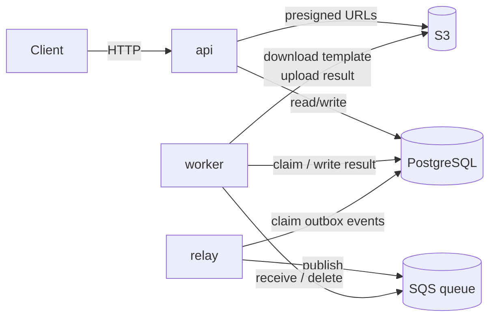
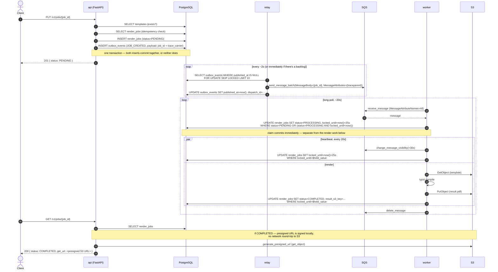
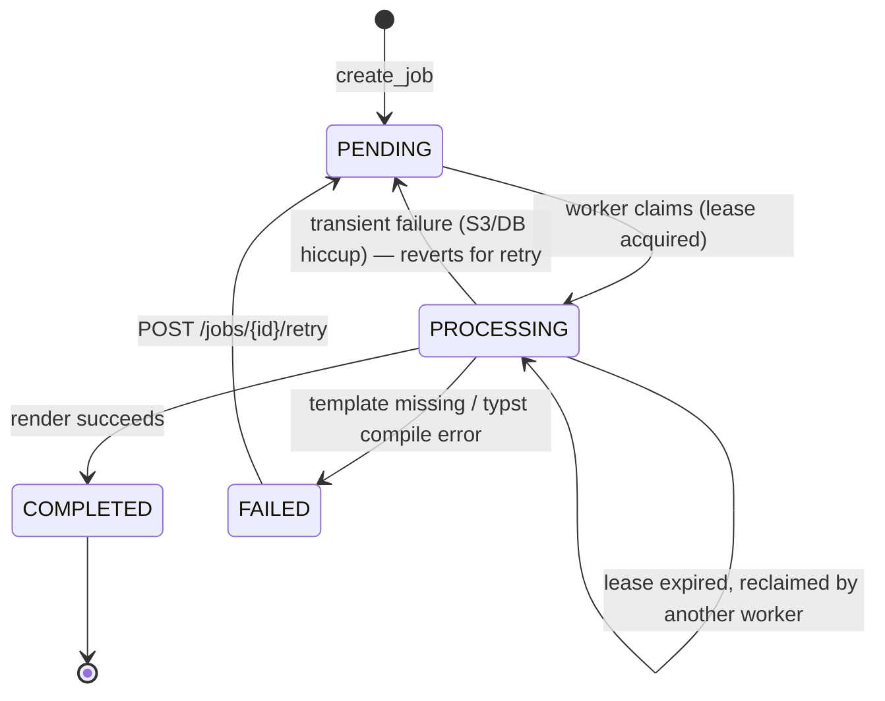
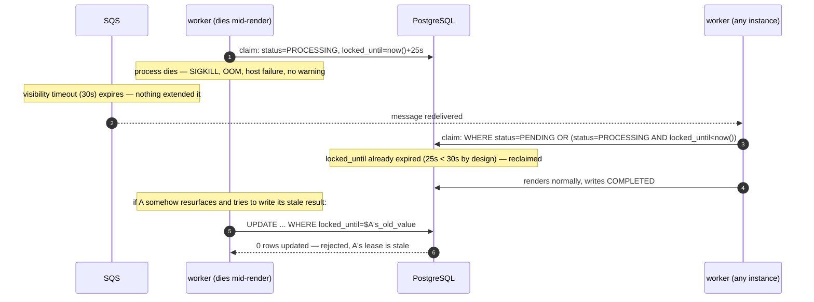

# Skryzhal

Async document-generation backend: Typst templates + JSON data → PDF. FastAPI + PostgreSQL + SQLAlchemy/Alembic, with S3/SQS (via LocalStack) for storage and queueing. Three independent processes — `api`, `worker`, `relay` — coordinated only through the database and the queue, never directly.

## Architecture



## Job lifecycle — from request to completion



### Status transitions



## Reliability mechanisms

| Mechanism | Where | Problem it solves |
|---|---|---|
| Idempotent create | `PUT /jobs/{id}` (client-supplied id) | Retried requests don't create duplicate jobs |
| Transactional outbox | `outbox_events` table | Job row and "publish to SQS" commit atomically — no dual-write gap |
| Retry + exponential backoff | `worker.py` | Transient render failures (S3/DB hiccups) don't fail permanently |
| Dead-letter queue | SQS redrive policy | Poison messages don't loop forever |
| Lease + fencing | `render_jobs.locked_until` | A worker that dies mid-render (any cause — SIGKILL, OOM, crash) doesn't leave the job stuck; a "zombie" worker that resurfaces can't overwrite a job someone else already reclaimed |
| Dead man's switch | Prometheus heartbeat gauges + Alertmanager | Detects a hung main loop, not just a dead process |

### Lease + fencing, in detail

A claim on `render_jobs` is only valid until `locked_until` — past that, it's up for grabs by anyone. The worker renews it periodically (in lockstep with the SQS visibility timeout, always slightly shorter — `SQS.LEASE_SECONDS = VISIBILITY_TIMEOUT_SECONDS - LEASE_BUFFER_SECONDS`), so a redelivered SQS message never finds a claim that's still "validly" held.

`locked_until` doubles as a fencing token: every write past the initial claim (lease renewal, or the final COMPLETED/FAILED/PENDING transition) is conditioned on `locked_until` still matching the exact value the worker was handed. If another worker has since reclaimed the job, that value has changed, and the write silently fails — the original ("zombie") worker's stale result is discarded instead of corrupting whoever's now the real owner.



## Local development

Everything runs against LocalStack — no real AWS account needed.

```bash
docker compose up -d
```

Services: `api` (`:8000`), `worker`, `relay`, `db` (`:5432`), `localstack` (`:4566`). Observability: Grafana (`:3001`, anonymous access) with Loki (logs), Prometheus (metrics, `:9090`), Alertmanager (`:9093`), and Tempo (traces).
